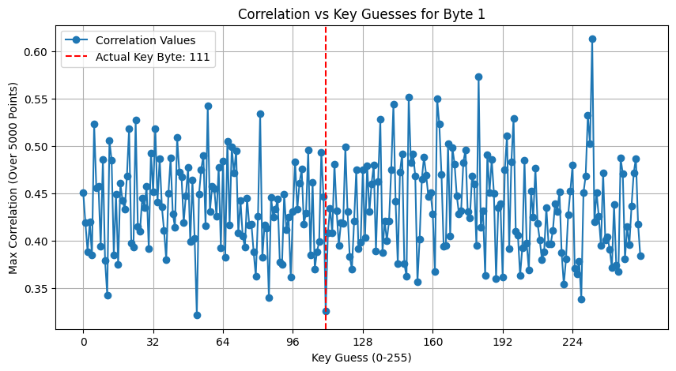
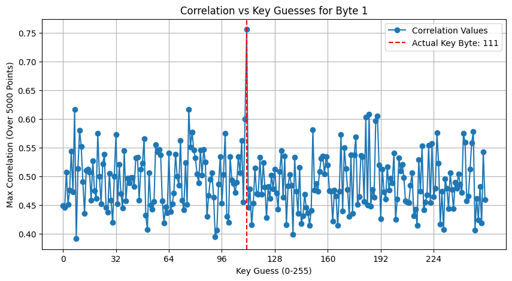

# pa2-cpa-attack

### 1. **Code given (not to be edited)**

### 2. **Analyzing noise**
We plotted the samples for few traces to identify patterns that can help distinguish random noise (250 points) from original power samples (5000 points). The traces are misaligned and random noise is there in the starting 0-250 points. So we just need to find where this misalignment is ending, and the actual trace is beginning. Some parts of the power trace remain constant which is the most uncommon pattern.

### 3. **Noise removal** 
We eliminated the misalignment by finding the transition point where the constant value (0.1) is followed by a different value, and extracted 5000 elements from that position for each trace.
    
    | Number of Trace | Start Index of Noiseless Power Samples |
    |------------------|---------------------------------------|
    | Trace 0         | 220                                   |
    | Trace 1         | 230                                   |
    | Trace 2         | 220                                   |
    | Trace 3         | 228                                   |
    | Trace 4         | 244                                   |
    | Trace 5         | 244                                   |
    | Trace 6         | 226                                   |
    | Trace 7         | 204                                   |
    | Trace 8         | 240                                   |
    | Trace 9         | 234                                   |
    | Trace 10        | 243                                   |
    | Trace 11        | 233                                   |
    | Trace 12        | 240                                   |
    | Trace 13        | 221                                   |
    | Trace 14        | 221                                   |
    | Trace 15        | 229                                   |
    | Trace 16        | 206                                   |
    | Trace 17        | 229                                   |
    | Trace 18        | 201                                   |
    | Trace 19        | 206                                   |
    | Trace 20        | 250                                   |
    | Trace 21        | 204                                   |
    | Trace 22        | 232                                   |
    | Trace 23        | 235                                   |
    | Trace 24        | 245                                   |
    | Trace 25        | 242                                   |
    | Trace 26        | 244                                   |
    | Trace 27        | 244                                   |
    | Trace 28        | 234                                   |
    | Trace 29        | 210                                   |
    | Trace 30        | 225                                   |
    | Trace 31        | 212                                   |
    | Trace 32        | 245                                   |
    | Trace 33        | 233                                   |
    | Trace 34        | 228                                   |
    | Trace 35        | 236                                   |
    | Trace 36        | 201                                   |
    | Trace 37        | 215                                   |
    | Trace 38        | 214                                   |
    | Trace 39        | 214                                   |
    | Trace 40        | 212                                   |
    | Trace 41        | 213                                   |
    | Trace 42        | 238                                   |
    | Trace 43        | 234                                   |
    | Trace 44        | 240                                   |
    | Trace 45        | 243                                   |
    | Trace 46        | 231                                   |
    | Trace 47        | 240                                   |
    | Trace 48        | 203                                   |
    | Trace 49        | 239                                   |
    
size of the original power trace array with noise: (50, 5250) 
    size of noiseless trace array:  (50, 5000)

### 4. **CPA Attack** 

- Hypothesis Generation:

    Assumed key guesses (0-255) for each byte of the AES key.  
    Computed intermediate values using the S-Box transformation:
    > V=SBox(Plaintext⊕KeyGuess)
    
     <!--stored in hypothetical_values (50, 256)-->
    
    Converted these values into Hamming Weight Model (number of 1s in binary representation). 
    
    <!--hw_model (50, 256)-->

- Correlation Computation:

    Computed Pearson Correlation between power traces and hypothetical Hamming weights.  
    The key guess with the highest correlation is the most probable key byte.

- Key Recovery:

    Repeated the above for all 16 AES key bytes. 
    Compared the guessed key with the actual key to evaluate accuracy.

   - **Accuracy (CPA Attack without Noise Removal):** 6.25%
   - **Accuracy (CPA Attack with Noise Removal):** 100%

### 5. **Correlation Plot**  

   Correlation plots illustrate how well different key guesses correlate with actual power consumption data.
   The x-axis represents possible key values (0-255), and the y-axis shows the maximum correlation value.
   A peak at the actual key byte indicates a successful attack.

   - without noise removal
   
       

       The peak is at wrong key byte. All correlation values are lower.
      
   - after noise removal
   
       
        
        The peak is at the correct key byte. correlation value at the peak is distinguishably higher compared to other local maxima values

   - Inferences
   
       **Before noise removal:** Correlation values are lower, and multiple peaks may exist, making key extraction harder.
    
       **After noise removal:** A clearer peak at the correct key byte is observed, improving attack accuracy.

   - All plots have been shown in the assignment2.ipynb file.
   

### 6. **Observations**
- Noise significantly affects CPA accuracy. Removing noise improves key recovery by enhancing correlation strength.

- CPA attack successfully reveals the AES key with high accuracy after noise removal.

 - > Key guess:  [ 24 111 181 111 233  50 246 104   1 132   6 120 225  63  74 150] 
 
    matched with
     > actual key: [ 24 111 181 111 233  50 246 104   1 132   6 120 225  63  74 150]
