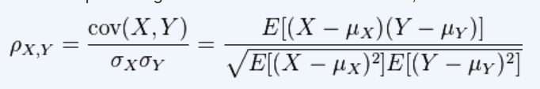
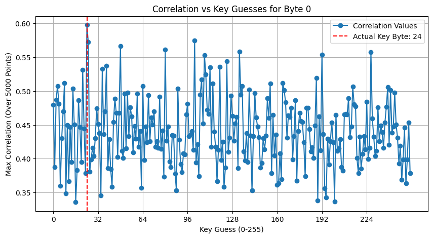
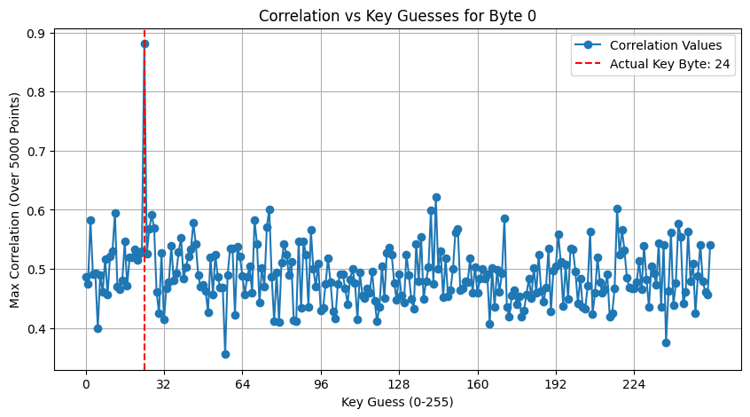

### Correlation Power Analysis attack on AES-128

### 1. **Analyzing noise**
We plotted the samples for few traces to identify patterns that can help distinguish random noise (250 points) from original power samples (5000 points). The traces are misaligned and random noise is there in the starting 0-250 points. So we just need to find where this misalignment is ending, and the actual trace is beginning. Some parts of the power trace remain constant which is the most uncommon pattern.

### 2. **Noise removal** 
We eliminated the misalignment by finding the transition point where the constant value (0.1) is followed by a different value, and extracted 5000 elements from that position for each trace.
  
size of the original power trace array with noise: (50, 5250) 
size of noiseless trace array:  (50, 5000)

### 3. **CPA Attack** 

- Hypothesis Generation:

    Assumed key guesses (0-255) for each byte of the AES key.  
    Computed intermediate values using the S-Box transformation:
    > V=SBox(Plaintext⊕KeyGuess)
    
     <!--stored in hypothetical_values (50, 256)-->
    
    Converted these values into Hamming Weight Model (number of 1s in binary representation). 
    
    <!--hw_model (50, 256)-->

- Correlation Computation:

    Computed Pearson Correlation between power traces and hypothetical Hamming weights, according to this formula  
      
    The key guess with the highest correlation is the most probable key byte.

- Key Recovery:

    Repeated the above for all 16 AES key bytes. 
    Compared the guessed key with the actual key to evaluate accuracy.

   - **Accuracy (CPA Attack without Noise Removal):** 6.25%
   - **Accuracy (CPA Attack with Noise Removal):** 100%

### 4. **Correlation Plot**  

   Correlation plots illustrate how well different key guesses correlate with actual power consumption data.
   The x-axis represents possible key values (0-255), and the y-axis shows the maximum correlation value.
   A peak at the actual key byte indicates a successful attack.
   
   - Case 1 (Wrong key guess)

       - without noise removal
       
           
    
           The peak appears at the wrong key byte, and all correlation values are lower, making it difficult to identify the correct key.
          
       - after noise removal
       
           
            
            The peak is now correctly aligned with the actual key byte. The correlation value at the peak is significantly higher than other local maxima, improving key distinguishability.

   - Case 2 (Correct key guess)

       - without noise removal
       
           
    
           The peak is at the correct key byte. However, the global maximum is not significantly higher than other local maxima, making key identification more challenging.
          
       - after noise removal
       
           
            
            The peak remains at the correct key byte, but now the correlation value is much higher than other local maxima, making it clearly distinguishable.

   - Inferences:
   
       **Before noise removal:** Correlation values are lower, and multiple peaks may exist, making key extraction harder.
    
       **After noise removal:** A clearer peak at the correct key byte is observed, improving attack accuracy.

   - All plots have been shown in the assignment2.ipynb file.
   

### 6. **Observations**
- Noise significantly affects CPA accuracy. Removing noise improves key recovery by enhancing correlation strength.

- CPA attack successfully reveals the AES key with high accuracy after noise removal.

 - > Key guess:  [ 24 111 181 111 233  50 246 104   1 132   6 120 225  63  74 150] 
 
    matched with
     > actual key: [ 24 111 181 111 233  50 246 104   1 132   6 120 225  63  74 150]
